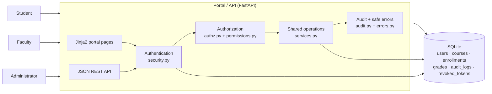
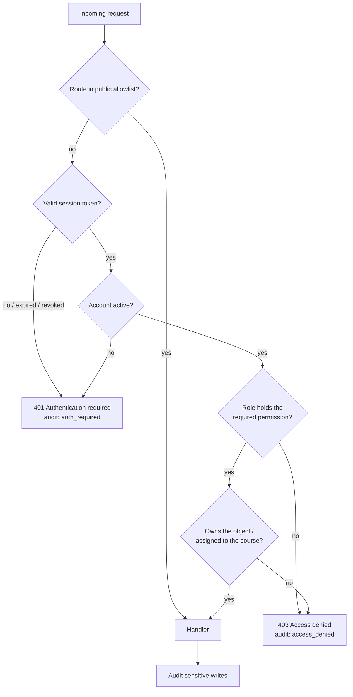

# Security Report — Role-Based Access Control College Portal

**Project:** A college portal separating Student, Faculty and Administrator functions and data
**Stack:** Python 3 · FastAPI · SQLAlchemy · SQLite · Jinja2
**Date:** 22 September 2026

---

## 1. Introduction and scope

Authentication answers *who is calling*; it does not answer *what they may do*. A portal that
stops at authentication lets any signed-in student request `/api/students/7/grades` and read
somebody else's results. This project implements the missing half — authorization — for a
college portal with three roles, and demonstrates that the controls hold when the client is
manipulated rather than merely when the UI is used as intended.

In scope: role and permission modelling, deny-by-default routing, object-level ownership and
assignment checks, session lifetime and revocation, audit logging, and safe error handling.
Out of scope: transport security (TLS termination is a deployment concern), password reset
flows, multi-factor authentication, and production-grade secret management.

The system holds three classes of sensitive data: **academic records** (grades), **personal
data** (accounts and enrollments) and **security telemetry** (the audit log). The adversary
assumed throughout is an authenticated but malicious portal user — the most realistic threat
for a campus system — who can craft arbitrary HTTP requests with a valid session.

---

## 2. Architecture and implementation

### 2.1 Component view



The browser portal and the JSON API are two front doors onto one enforcement path. A page is
never protected by the absence of a link: the same `require_permission(...)` dependency and the
same ownership helpers run for `GET /portal/grades` and for `GET /api/students/4/grades`, and
both write actions go through `app/services.py`.

### 2.2 Request authorization flow



Four independent gates stand between a request and a record, and the role is re-read from the
database on every request — so a role change or a deactivation takes effect immediately,
without waiting for the token to expire.

### 2.3 Data model

`Grade → Enrollment → (student, course) → course.faculty` is the ownership chain the
authorization layer walks. A student owns a grade through their enrollment; an instructor
reaches a course through the `faculty_id` assignment, which only an administrator can change.
Neither relationship is ever derived from a request body.

### 2.4 Deny by default, proven at startup

`verify_deny_by_default(app)` walks the composed route table at application start and raises if
any endpoint outside a seven-entry public allowlist lacks a permission requirement. A forgotten
guard is therefore a crash during development rather than a silent hole in production, and
`tests/test_deny_by_default.py` asserts the same property.

---

## 3. Role-permission matrix

| Permission | Student | Faculty | Administrator |
|------------|:-------:|:-------:|:-------------:|
| `meta:read` | ✓ | ✓ | ✓ |
| `profile:read_own` | ✓ | ✓ | ✓ |
| `grades:read_own` | ✓ | | |
| `courses:read_enrolled` | ✓ | | |
| `courses:read_assigned` | | ✓ | |
| `roster:read_assigned` | | ✓ | |
| `grades:read_course` | | ✓ | |
| `grades:write_course` | | ✓ | |
| `announcements:write_course` | | ✓ | |
| `users:read_any` | | | ✓ |
| `users:manage` | | | ✓ |
| `roles:assign` | | | ✓ |
| `courses:manage` | | | ✓ |
| `enrollments:manage` | | | ✓ |
| `announcements:write_global` | | | ✓ |
| `audit:read` | | | ✓ |

Two design decisions are worth calling out:

1. **The administrator is not a superset.** Administrators manage accounts, courses and
   oversight but hold neither `grades:write_course` nor `grades:read_own`. A compromised
   administrator account cannot quietly alter academic results — it would first have to assign
   itself a faculty role and a course, which is two audited events.
2. **Scope is encoded in the permission name.** `_own`, `_enrolled`, `_assigned` and `_any`
   state what the permission covers, which is what makes the second check (ownership) an
   obvious requirement rather than an afterthought.

---

## 4. Security controls

### 4.1 Authentication and sessions

Passwords are hashed with bcrypt over a SHA-256 pre-hash (so a long passphrase cannot be
silently truncated at bcrypt's 72-byte limit). Sessions are HS256 JWTs carrying `sub`, `role`,
`jti` and `exp`, delivered as an `HttpOnly; SameSite=Lax` cookie to the browser and as a bearer
token to API clients. The default lifetime is 30 minutes.

Logout inserts the token's `jti` into a `revoked_tokens` blocklist that is consulted on every
request, so a stolen token stops working the moment the user signs out rather than when it
would have expired.

### 4.2 Horizontal access control (ownership)

`ensure_self`, `get_own_enrollment`, `get_assigned_course` and `get_enrollment_in_course` decide
access from server-side state only. Student identity comes from the verified session, never
from the path or body: `/api/students/{id}/grades` compares `{id}` against the session subject
and refuses on mismatch. Faculty writes require both that the course names the caller as
instructor *and* that the target student is on that roster.

### 4.3 Vertical access control (roles)

Every endpoint declares the permission it needs; the role must hold it. Privileged routes are
unreachable by lower roles regardless of how the request is shaped, including the classic
self-promotion attempt `PUT /api/admin/users/{self}/role`. Administrators are additionally
barred from changing their own role or deactivating their own account, which prevents both
quiet self-elevation and locking the institution out of its own portal.

### 4.4 Audit logging

`audit_logs` records the actor (id, username and role copied in, so the trail survives renames),
action, target, outcome, path, method, IP and timestamp. Sensitive operations — grade writes
with before/after values, role assignments, account changes, course assignments, enrollments,
logins and logouts — are recorded at the point of change. Refusals are recorded centrally in the
exception handler, so a newly added route cannot forget to log them. The log is readable only
with `audit:read`, i.e. by administrators.

### 4.5 Brute-force resistance

Five failed attempts within the window lock an account for 15 minutes. Unknown usernames are
still compared against a dummy hash so response timing does not distinguish them, and the lock
itself is invisible in the response — it is visible only in the audit log.

### 4.6 Safe error handling

| Situation | Status | Body |
|-----------|--------|------|
| No/expired/revoked session (API) | 401 | `{"detail": "Authentication required"}` |
| No/expired session (browser) | 303 | redirect to `/login?expired=1` |
| Wrong role, wrong owner, or object absent | 403 | `{"detail": "Access denied"}` |
| Bad credentials | 401 | `{"detail": "Invalid username or password"}` |
| Malformed input | 422 | `{"detail": "Invalid request"}` |
| Unhandled exception | 500 | `{"detail": "Internal server error"}` |

Denials are deliberately indistinguishable: a student probing `/api/students/{n}/grades` learns
nothing about which ids exist. Validation errors do not echo the submitted value, which also
removes a convenient reflection point for injected content, and tracebacks never leave the
server.

---

## 5. Testing and evidence

150 automated tests run against the real application. The suite is organised as positive cases,
vertical escalation, horizontal escalation, session handling, audit assertions, error-shape
assertions, and a structural check that no route escapes the authorization layer.

```
tests/test_auth.py            authentication, tokens, expiry, logout replay
tests/test_deny_by_default.py route-table audit, matrix invariants
tests/test_student_access.py  own-record access and cross-student attempts
tests/test_faculty_access.py  assigned-course access and cross-instructor attempts
tests/test_admin_access.py    administration and self-promotion attempts
tests/test_audit.py           what the trail records
tests/test_error_safety.py    uniform refusals, lockout, no internals leaked
tests/test_portal_ui.py       the browser portal under the same rules
tests/test_access_matrix.py   the full role × endpoint table
```

### 5.1 Access-control matrix — expected vs actual

Reproduced by `pytest tests/test_access_matrix.py -v`; every row passed.

| Operation | Student | Faculty | Administrator | Anonymous |
|-----------|:-------:|:-------:|:-------------:|:---------:|
| Read own grades | **200** | 403 | 403 | 401 |
| Read another student's grades | **403** | 403 | 403 | 401 |
| Read own enrolled courses | **200** | 403 | 403 | 401 |
| Read roster of an assigned course | 403 | **200** | 403 | 401 |
| Read roster of another instructor's course | 403 | **403** | 403 | 401 |
| Write a grade on an assigned course | 403 | **200** | 403 | 401 |
| Write a grade on another instructor's course | 403 | **403** | 403 | 401 |
| List all accounts | 403 | 403 | **200** | 401 |
| Change a user's role | 403 | 403 | **200** | 401 |
| Read the audit log | 403 | 403 | **200** | 401 |
| Read the permission matrix | 200 | 200 | 200 | 401 |

### 5.2 Attack demonstration

`python demo_attacks.py` starts a throwaway portal, authenticates as ordinary users and then
attacks it. All 15 attempts behaved as expected (full output in
[`evidence/attack_demo.md`](evidence/attack_demo.md)):

| Category | Attempt | Expected | Actual |
|----------|---------|:--------:|:------:|
| baseline | Student reads their own grades | 200 | 200 |
| baseline | Faculty reads their own course roster | 200 | 200 |
| baseline | Administrator lists accounts | 200 | 200 |
| horizontal | Student A requests Student B's grades by id | 403 | 403 |
| horizontal | Student A requests Student B's profile | 403 | 403 |
| horizontal | Faculty opens a colleague's roster | 403 | 403 |
| horizontal | Faculty writes a grade on a colleague's course | 403 | 403 |
| vertical | Student calls an administrator endpoint | 403 | 403 |
| vertical | Student promotes themselves to administrator | 403 | 403 |
| vertical | Student writes a grade for themselves | 403 | 403 |
| vertical | Faculty reads the audit log | 403 | 403 |
| vertical | Administrator edits a grade | 403 | 403 |
| session | Request with no session at all | 401 | 401 |
| session | Request with a forged token | 401 | 401 |
| session | Token replayed after logout | 401 | 401 |

### 5.3 Audit trail produced by the attacks

Excerpt written by the same run:

| Actor | Role | Action | Endpoint | Detail |
|-------|------|--------|----------|--------|
| student.alice | student | `access_denied` | `/api/students/5/grades` | status=403 |
| student.alice | student | `access_denied` | `/api/admin/users` | status=403 required=users:read_any |
| student.alice | student | `access_denied` | `/api/admin/users/4/role` | status=403 required=roles:assign |
| faculty.brown | faculty | `access_denied` | `/api/faculty/courses/3/roster` | status=403 |
| faculty.brown | faculty | `access_denied` | `/api/admin/audit` | status=403 required=audit:read |
| admin.root | admin | `access_denied` | `/api/faculty/courses/1/grades` | status=403 required=grades:write_course |
| anonymous | – | `auth_required` | `/api/students/4/grades` | status=401 |
| student.bob | student | `auth_required` | `/api/students/5/grades` | status=401 (token replayed after logout) |

Note the last two rows: the identity of a *refused* request is still recovered from the
presented token where one exists, which is what makes the trail useful for incident response.

### 5.4 Test run

Full verbose output is stored in [`evidence/pytest_output.txt`](evidence/pytest_output.txt):

```
150 passed
```

---

